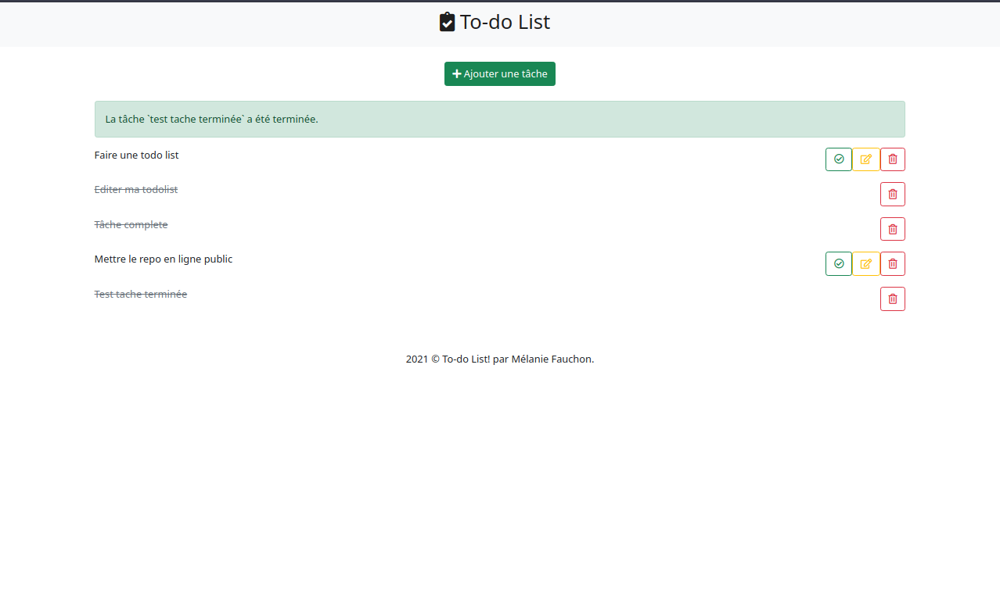

# To Do list

Ceci est un projet perso de to-do list crée avec Symfony avec stockage des tâches en base de données afin de les afficher même avec le refresh de la page.

## Aperçu 

<kbd></kbd>

## Pour faire fonctionner le projet

Après avoir cloné le projet, installez les dépendances avec 
```
composer install
```

Afin d'avoir accès à une database, configurez celle-ci dans un fichier `.env.local` à la racine du projet

Créez ensuite la database avec 
```
bin/console doctrine:database:create
```

Puis jouez les migrations avec 
```
bin/console doctrine:migration:migrate
```

Lancez un serveur local pour faire fonctionner l'application